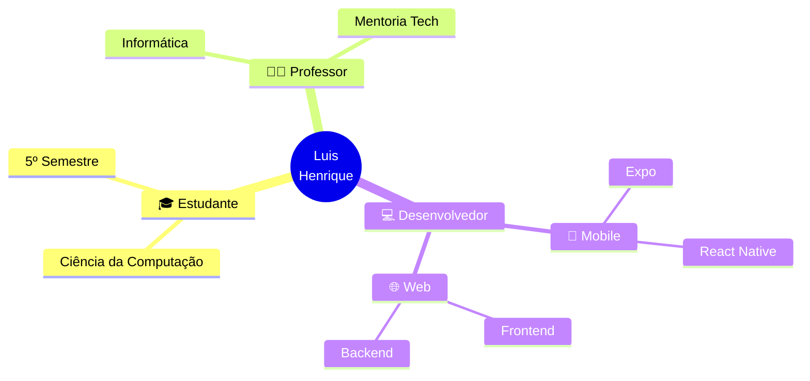

<!--
╔══════════════════════════════════════════════════════════════╗
║                  LUIS HENRIQUE PALACIO                       ║
║              Professor · Dev · Estudante                     ║
╚══════════════════════════════════════════════════════════════╝
-->

<div align="center">


<a href="https://git.io/typing-svg">
  
</a>

<br>

<a href="https://linkedin.com/in/luishpalacio/"></a>
<a href="mailto:luispalacio1617@gmail.com"></a>
<a href="https://portifolio-rho-seven-24.vercel.app/"></a>

<br><br>


</div>

<br>

<!-- ━━━━━━━━━━━━━━━━━━━━━━━━━━━━━━━━━━━━━━━━━━━━━━━━━━━━━━━━━━━━ -->

## <samp>◢ Sobre mim</samp>



<table width="100%">
<tr>
<td width="50%" valign="top">

### ⚡ &nbsp; Atualmente

```diff
+ Desenvolvendo o FinFlow Finanças
+ Aprofundando em arquitetura de software
~ Compartilhando conhecimento em sala
! Explorando IoT com Arduino
```

</td>
<td width="50%" valign="top">

### 🎯 &nbsp; Foco

```diff
> Apps mobile com Expo
> Front-end React / TypeScript
> APIs REST com Java + Spring
> Automação com Python
```

</td>
</tr>
</table>

<br>

<!-- ━━━━━━━━━━━━━━━━━━━━━━━━━━━━━━━━━━━━━━━━━━━━━━━━━━━━━━━━━━━━ -->

## <samp>◢ Projeto em Destaque</samp>

<div align="center">

<table>
<tr>
<td align="center" width="100%">

<h3>💸 &nbsp; FinFlow Finanças</h3>

<p><i>Aplicativo de gestão financeira pessoal — simplicidade, clareza e controle no seu bolso.</i></p>

<p>


</p>

</td>
</tr>
</table>

</div>

<br>

<!-- ━━━━━━━━━━━━━━━━━━━━━━━━━━━━━━━━━━━━━━━━━━━━━━━━━━━━━━━━━━━━ -->

## <samp>◢ Stack Tecnológica</samp>

<table width="100%">
<tr>
<td valign="top" width="33%">

<div align="center">

#### 🎨 &nbsp; Frontend & Mobile


</div>

</td>
<td valign="top" width="33%">

<div align="center">

#### ⚙️ &nbsp; Backend & DB


</div>

</td>
<td valign="top" width="33%">

<div align="center">

#### 🛠️ &nbsp; Ferramentas


</div>

</td>
</tr>
</table>

<br>

<!-- ━━━━━━━━━━━━━━━━━━━━━━━━━━━━━━━━━━━━━━━━━━━━━━━━━━━━━━━━━━━━ -->

## <samp>◢ GitHub Analytics</samp>

<div align="center">


<br><br>


<br><br>


</div>

<br>

<!-- ━━━━━━━━━━━━━━━━━━━━━━━━━━━━━━━━━━━━━━━━━━━━━━━━━━━━━━━━━━━━ -->

## <samp>◢ Atividade</samp>

<div align="center">


<br><br>


</div>

<br>

<!-- ━━━━━━━━━━━━━━━━━━━━━━━━━━━━━━━━━━━━━━━━━━━━━━━━━━━━━━━━━━━━ -->

<div align="center">

### <samp>◢ Dev Quote</samp>


</div>

<br>

<div align="center">
  
</div>
